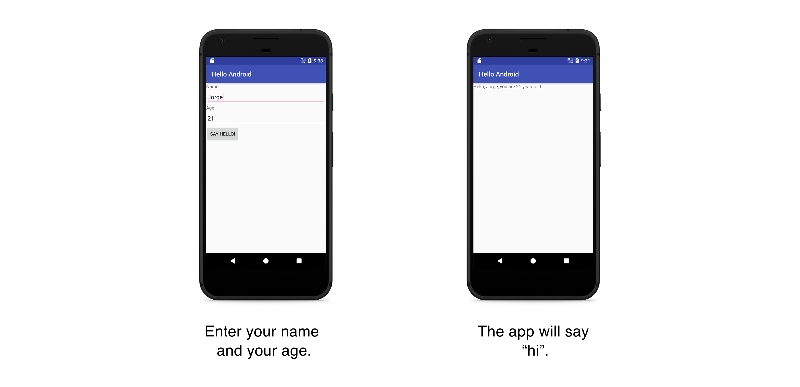

# 👋 HelloAndroid
A Hello World Android app developed for Mobile Development course of the CS Engineering degree at University of Valladolid.

## Development
### Getting started
Follow these instructions to build and run the project:
1. Clone this repository.
2. Download the appropriate [JDK](http://www.oracle.com/technetwork/java/javase/downloads/jdk8-downloads-2133151.html) for your system. We are currently on JDK 8.
3. [Install Android Studio](https://developer.android.com/sdk/index.html).
4. Import the project. Open Android Studio, click `Open an existing Android Studio project` and select the project. Gradle will build the project.
5. Run the app. Click `Run > Run 'app'`. After the project builds you'll be prompted to build or launch an emulator.
